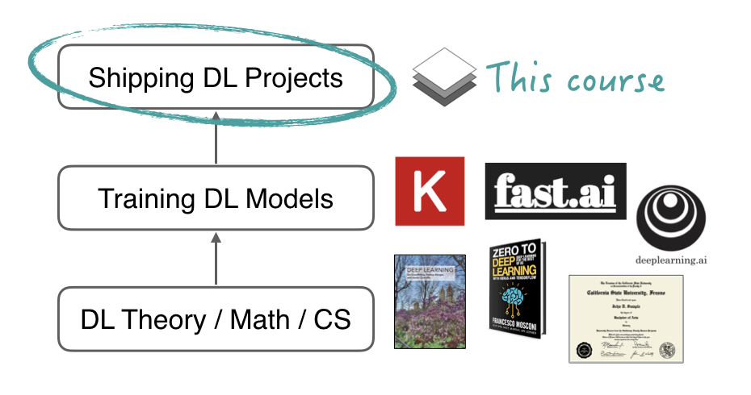

# Fullstack Deep Learning
This is the repository for
 [Spring 2021 Fullstack Deep Learning course ](https://fullstackdeeplearning.com/spring2021)

The final project is creating a Data Flywheel in MLOps pipeline.
The video presentation is
 [Creating Data Flywheel in MLOps Pipeline ](https://youtu.be/rf9nAk0XnqY).

# Problems Statement
How can we build an MLOps pipeline that can improve itself over time
as it ingests more data?

# Solution
Build an MLOps pipeline to collect and annotate more data
in a systematic and automated way.

1. Cluster dataset into separate categories
2. Balance the clusters
3. New data is added to similar clusters
4. Re-cluster/add more clusters/re-balance periodically
5. Train the model first and use the results to collect/annotate more data for the needed clusters

# Approaches
To build a self-improving MLOps pipeline, a way to measure dataset quality is needed.
To do so, we experimented with clustering data using auto-clustering algorithms
and a probabilistic neural network to measure model's confidence together with the predictions

# Code
- The entire code is in [here](https://github.com/mahavird/fsdl_project).
- The project proposal and the report are under project folder
- [Measuring dataset quality with probability](project/measuring_dataset_quality_with_probability.ipnb)
contains the code and documentation for the results.
- The report is also under the same project folder:
 [How to measure dataset quality](project/how_to_measure_dataset_quality.md)
- The rest of experimental notebooks (not cleaned yet) are under notebook folder.

 

