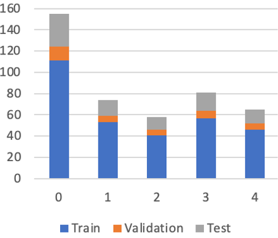
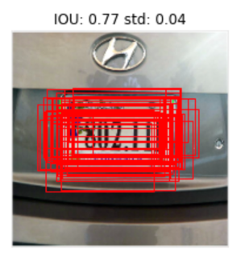
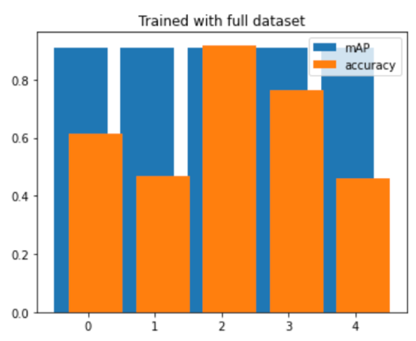
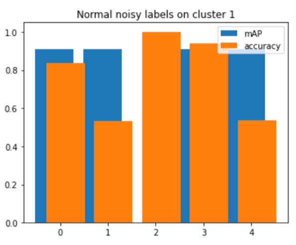
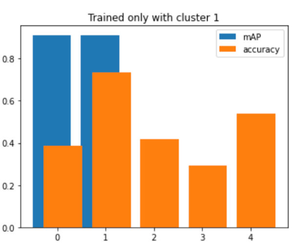
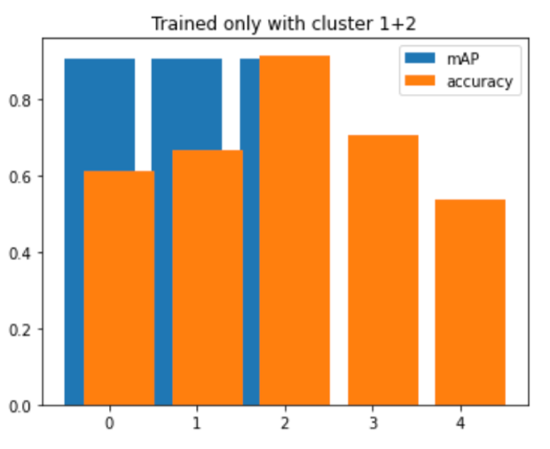
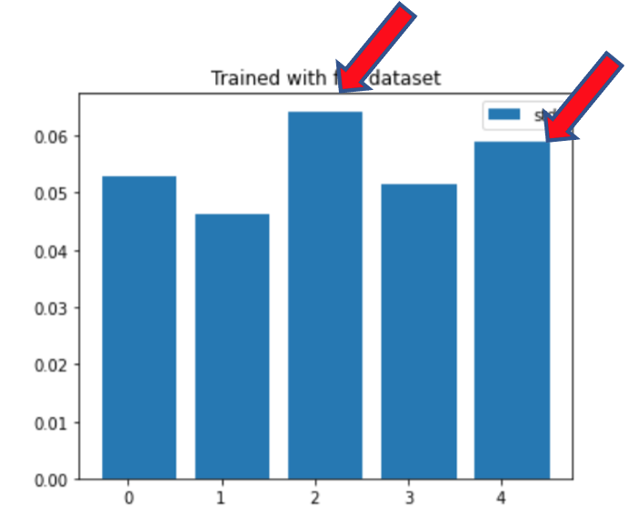
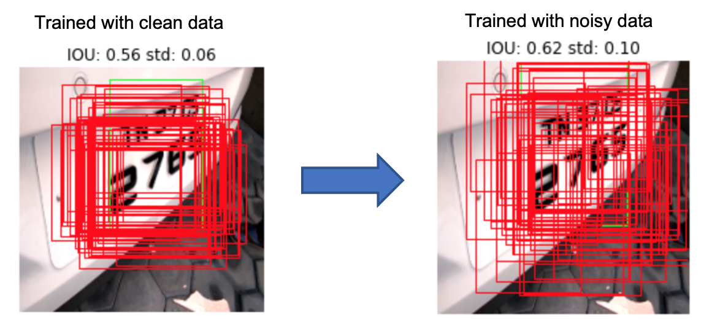
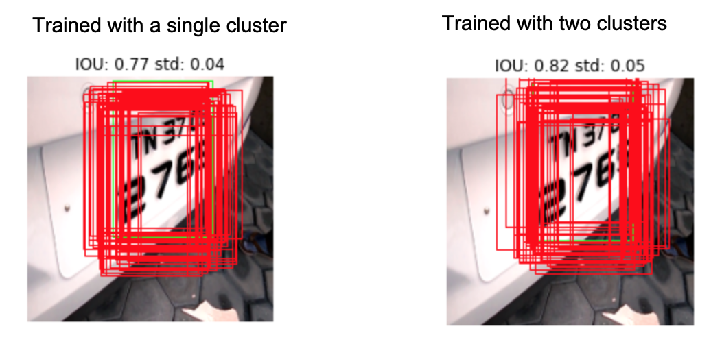

# How to measure data set quality in MLOps pipeline

## 1. Problem Statement

Are there systematic and automated ways to measure dataset quality?

A recent [talk](https://youtu.be/06-AZXmwHjo) by Andrew Ng highlighted
the critical role that data quality plays in AI development.
So far, ML practitioners have beeing taking a model-centric approach to AI
where they tried to improve AI systems by re-designing the network architecture
or fine-tuning hyperparameters. In practice, dataset quality alone affect
the performance of AI the most by far. However, we do not have a good way 
to measure dataset quality. The goal of the project is to find a systematic
and automated way to measure and improve dataset quality.
We want to demonstrate how it is possible to make an MLOps pipeline 
into a "Data Flywheel" where the model can continue to improve by ingesting
 more diverse data in an automated and systematic way.
  
## 2. Goal

The project goal is to establish a set metrics and processes that can be used to measure the quality of dataset.
The motivation came from the need to objectively measure both the quality of raw dataset and the annotation quality.
In the literature, there isn't an established process or consensus on how to compare the quality of different datasets.
Any problem with the dataset is detected manually and ad hoc basis.
Our goal is to come up with ways to tackle this problem in systematic and scalable ways.
To demonstrate how this can be done, we plan to use license plate data that Mahavir plans to release.
We will build a pipeline and a data flywheel template to process, train, and release an AI model.

## 3. Existing
There can be at least two dimensions to dataset quality problems:
the quality of the raw data itself and the quality of human annotations. 

1. Raw dataset quality

   The raw data can be misrepresented, imbalanced, corrupted, unwanted, duplicated,
biased, etc. Class imbalance, for instance, is a common problem for many ML engineers
and various methods exist to compensate or overcome the problems.
In addition, within the class itself, it can be imbalanced when it does not 
have the same distribution as the real data.
Even if the model is trained in well balanced dataset, dataset shift can occur
and its performance will be changed and we need a way to know when it happens.
Manually inspecting each data is not scalable so we would like a way to know
the dataset distributions and monitor its changes over time.
A clustering algorithm is an unsupervised machine learning methodology that
can be used. It can find similarities based on features that humans have
a hard time articulating in words.

2. Annotation quality

   Even when the raw data is balanced and unbiased, if annotations are done poorly,
the model will not be trained well. There can be inconsistency and inaccuracy introduced
by humans-in-the-loop, but it is hard to measure how well annotations are done
objectively. Two known methods to compare the quality of datasets are:

   *A. Training a well-known model:* After the annotation is done, one can use
   it to train against a well-known model whose benchmark performance metrics are known.
   If the annotation is done accurately, the model will be trained faster and predicted better.
   Though this is a popular method, it is not bullet proof as the dataset is not the same
   and thus have different distributions. 
   
   *B. Duplicate annotation:* A lesser known approach is to have two different
   annotators or teams to label the same dataset and compare the results side-by-side.
   Though this is probably the best way to compare the quality of datasets,
   it is expensive and cannot be repeated for any practical purposes.

Ideally, we want the model to tell us that it is not so certain about the prediction
or simply say "I don't know" when it encounters something it is not trained on.
A typical neural network gives only a single deterministic answer and does not
give a confidence measure.
On the other hand, a probabilistic neural network gives a distribution of predictions
 instead of a single answer so it is a good way to measure uncertainty.

## 4. Our Approach
Given the problems and existing solutions, we tried two methods.
First, we used a probabilistic model so that we can measure uncertainty.
Second, data is run through a clustering algorithm to find good ways to
group them into clusters of similar kinds.

### a. The Dataset
For experiments, a [kaggle license plate data set]( https://www.kaggle.com/andrewmvd/car-plate-detection.)
It has 433 images with the license plate location and size annotated for each image.
A smaller dataset is faster to train and analyze so this seemed to be a good setup
for making experiments.

### b. Clustering
The dataset was then clustered into five different clusters,
each of which was partitioned into training, validation and test sets.

To run the clustering algorithm, the images was passed through
VGG16's convolutional layers to extract the feature maps.
The feature maps were normalized to use the cosine similarity for clustering.
The reason for using the feature maps instead of Euclidean distance
is to use the image's features instead of pixel distributions.
Both methods were tried, but cosine similarity with the feature maps
tend to produce more sensible clusters.
Five clusters are used mainly to arrive at more balanced distributions
for all clusters. A higher number will give a very imbalanced distributions
because the dataset was too small.

### c. The Model
The model was built on top of VGG16 with additional layers to train for
license plate detection. VGG16's weights were frozen.
The final output layer was changed to DenseFlipout instead of
 the regular Dense layer so that it give probabilistic output.
Ideally, other layers should be probabilistic too, but such fully
probabilistic model failed to converge so the hybrid model was used instead. 
Here is the layout of the model. 

  model.add(tfp.layers.DenseFlipout(4, activation="sigmoid", kernel_divergence_fn=kl_divergence_fn))
`

_________________________________________________________________
Layer (type)                 Output Shape              Param #   
_________________________________________________________________
vgg16 (Functional)           (None, 7, 7, 512)         14714688  
_________________________________________________________________
flatten_2 (Flatten)          (None, 25088)             0         
_________________________________________________________________
dense_6 (Dense)              (None, 128)               3211392   
_________________________________________________________________
dense_7 (Dense)              (None, 128)               16512     
_________________________________________________________________
dense_8 (Dense)              (None, 64)                8256      
_________________________________________________________________
dense_flipout_2 (DenseFlipou (None, 4)                 516       
_________________________________________________________________
Total params: 17,951,364
Trainable params: 3,236,676
Non-trainable params: 14,714,688 

### d. The Setup
The same probabilistic model was trained on four different datasets.
They were:

- Clean dataset: all annotations are good One noisy cluster:
- One noisy cluster: clean dataset except one noisy cluster
 (0.02% noise was introduced)
- One cluster dataset – data from a single cluster
- Two cluster dataset – data from two clusters

Noise here means the process of altering the original annotations slightly.
The models were trained on 100 epochs each and then were predicted
for the same test data 100 times. The model's prediction distributions were
measured for its accuracy and standard deviations.
Here is an example of the probabilistic output from the model.

## Results

The hypothesis was that the model will perform poorly
on unseen data or annotations were done poorly.
Other than the model's standard accuracy, mAP (mean Average Precision)
was used for object detection.
To measure uncertainty, standard deviations of predictions were calculated.

### Accuracy
The accuracy results were mostly as expected.
The model performed poorely on unseen data as we can see
from the one cluster and two cluster model's accuracy.
Noisy cluster model's performance degraded a little bit
but the effects were small. The reason is probably the noise was 
within the normal error of distributions and thus the model's 
training was not affected that much.

### Variations
For uncertainty, the model trained on the clean dataset
showed higher standard deviations for cluster 2 and 4.
Combined with the model's poor performance in these two clusters,
the conclusion is that the model is less certain about these two clusters.

Furthermore, we see that the same images tend to have
increased uncertainty as noise was introduced as can be seen from this example.

However, it was not always the case.
With the limited training set, the models trained with one
 or two clusters became more certain about its prediction
 though they were wrong.
 
 
 
So using the standard deviation does not always seem to be a reliable 
measure for uncertainty. To do so, more diverse and bigger datasets
seem to be needed.

## Conclusion
Though the results are mixed and limited, it paves a way to
approach how we can add systems and automation to MLOps pipeline.
The Data Flywheel can be run as follows:

1. Cluster the dataset into separate categories
2. Balance the clusters
3. New data is added to similar clusters
4. Re-cluster/add more clusters/re-balance periodically
5. Train the model first and use the results to collect/annotate more data for the needed clusters

We will continue to experiment and build more automation on the 
pipeline in the future.

## References

- [Uncertainty in Deep Learning. How To Measure?](https://towardsdatascience.com/my-deep-learning-model-says-sorry-i-dont-know-the-answer-that-s-absolutely-ok-50ffa562cb0b)
- [How can I improve the quality of my data](https://lionbridge.ai/training-data-guide/#how-can-i-improve-the-quality-of-my-data)
- [How to measure quality when training machine learning models](https://labelbox.com/blog/how-to-measure-quality-when-training-machine-learning-models/)

 